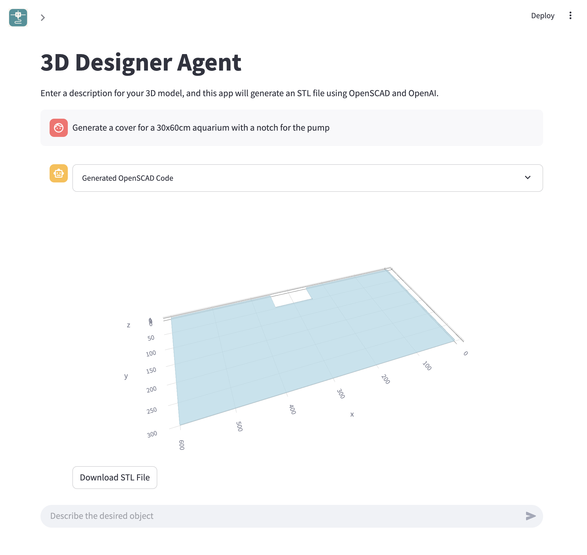

# 3D Designer Agent

A Dockerized Streamlit app that converts text prompts into printable STL models via OpenAI + OpenSCAD.

## Local Usage with Docker

1. Build the Docker image:
   ```bash
   docker build -t 3d-designer-agent .
   ```
2. Run the container (passing your OpenAI key):
   ```bash
   docker run --rm -p 7860:7860 -e OPENAI_API_KEY=$OPENAI_API_KEY 3d-designer-agent
   ```
3. Visit http://localhost:7860 in your browser.

## Deploy on Hugging Face Spaces

1. Create a new Space → **SDK: Docker**.  
2. Push this repo (including the `Dockerfile` and `.dockerignore`) to it.  
3. (Optional) In the Space's **Settings → Secrets**, add your own `OPENAI_API_KEY` to pre-fill the sidebar input. If you leave it empty, visitors can enter their own API key in the app's sidebar.  
4. Wait for the build; your app will be live at  
   `https://<your-username>.hf.space/<space-name>`.

## Demo



For more example models and usage patterns, see our Medium post: [Vibe Modeling: Turning Prompts into Parametric 3D Prints](https://medium.com/@nchourrout/vibe-modeling-turning-prompts-into-parametric-3d-prints-a63405d36824).

Made by [Flowful.ai](https://flowful.ai)